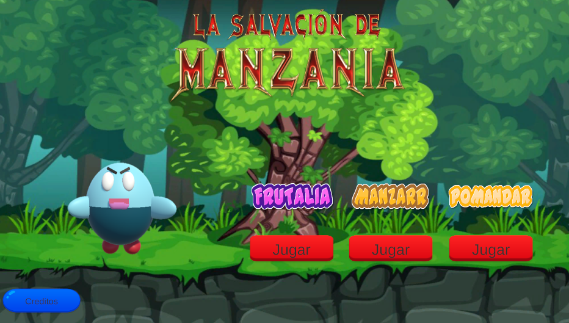

  

<h3 align="center">
Manzania es un juego de aventura y recolección ambientado en tres mundos únicos: Frutalia, Manzarr y Pomandar, cada uno con sus propios paisajes y desafíos relacionados con manzanas exóticas y huertos. El jugador controla a Malus, un héroe que debe salvar su planeta de un virus que afecta los árboles de manzana, explorando los mundos, recolectando frutas especiales y enfrentándose a enemigos hostiles. A lo largo del juego, interactúa con personajes como Melinda, Cider, Pippin y Fuji, utiliza herramientas como la espada de manzana dorada y el hacha de podar, y debe gestionar tickets y misiones para restaurar la producción de manzanas, mientras avanza en una narrativa divertida y colorida diseñada para jugadores de todas las edades que disfrutan de aventuras, acción y simulación de recolección.</h3>

<h2 align="center">🚀Development technologies🧑‍💻</h2>

  

<h2 align="center">Mundos 🌍🌎🌏</h2>

<li><strong>Frutalia</strong>: Un mundo exótico y colorido lleno de árboles frutales gigantes, entre los cuales los más impresionantes son los manzanos gigantes que producen manzanas dulces y jugosas que son una delicia para cualquier visitante</li>
<li><strong>Manzarr</strong>: Este mundo está cubierto de interminables huertos de manzanos, con una gran variedad de sabores y colores de manzanas. La gente de Manzarr ha perfeccionado la técnica de elaboración de sidra de manzana, convirtiéndolo en el mejor lugar para encontrar bebidas a base de manzana.</li>
<li><strong>Pomandar</strong>: Un mundo árido y desértico que ha sido transformado por la tecnología en un paraíso de manzanas. Los manzanos crecen en grandes invernaderos y se utilizan tecnologías avanzadas para controlar la humedad y la temperatura. Las manzanas son de una calidad suprema y están disponibles todo el año.</li>
 

<h2 align="center">Personaje principal 🥷</h2>

<li><strong>Malus</strong>: Personaje protagonista del juego, será controlado por el usuario, es el héroe de Manzania un mundo que está en peligro.
</li>

<h2 align="center">Personaje secundario 💂‍♀️🦹‍♀️</h2>

<li><strong>Honeycrisp</strong>: Un grupo de villanos que intentan robar y atacar a cualquiera que se encuentren.
</li>

<h2 align="center">Herramientas ⚔️🪓</h2>

<li><strong>Espada de manzana dorada</string>: arma de cuerpo a cuerpo.
Hacha de podar: Una herramienta muy útil para cortar ramas y frutas de los árboles en los huertos de Manzania. En caso de emergencia, también se puede utilizar como arma de cuerpo a cuerpo.
</li>
<li><strong>Hacha de podar</strong>: Una herramienta muy útil para cortar ramas y frutas de los árboles en los huertos de Manzania. En caso de emergencia, también se puede utilizar como arma de cuerpo a cuerpo.
</li>

<h2 align="center">Items 🍎🍏</h2>

<li><strong>Manzana verde</strong>: Agrega 5 puntos de salud.
</li>
<li><strong>Manzana roja</strong>: Estas son las manzanas para recolectar.
</li>
<li><strong>Manzana dorada</strong>: Restará 15 puntos de salud.
</li>
<li><strong>Árboles espinosos</strong>: Restarán 10 puntos de salud.
</li>
 

> [!IMPORTANT]
> Juego actualmente publicado en: https://play.unity.com/en/games/f5e7d3a4-767f-4324-8722-f4179faf3c7a/manzania.

<h2 align="center">Papel y objetivo del jugador 🎯</h2>

El papel del jugador en este juego sería Malus, el protagonista, quien se ha propuesto encontrar una solución para salvar su planeta de la infección viral que ha afectado a los árboles de manzana. El objetivo del jugador sería ayudar a Malus a viajar al planeta vecino, enfrentarse a las criaturas hostiles y peligrosas, y recolectar tantas manzanas como sea posible que sean resistentes al virus para llevarlas de vuelta a Manzania y restaurar la producción de manzanas en el planeta.

<h2 align="center">Interacción con el mundo 🎮</h2>

El jugador interactúa con el mundo explorando los tres mundos, recolectando manzanas y luchando contra enemigos hostiles.

<h2 align="center">Publico objetivo 🎯🧑‍🦰</h2>

El público objetivo para este juego podría ser personas de todas las edades que disfrutan de juegos casuales y de aventura. Los mundos coloridos y exóticos, el divertido concepto de usar manzanas como armas y herramientas, y el tema de salvar un planeta de un virus podrían atraer tanto a niños como a adultos. Además, los fanáticos de los juegos de simulación y agricultura pueden disfrutar del aspecto de cultivar y cosechar manzanas, mientras que los fanáticos de los juegos de acción pueden disfrutar de los elementos de combate.

> > > > > > > (VERSION: Manzania 1.0.0)
